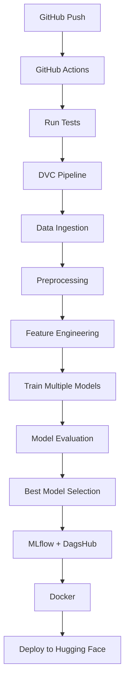
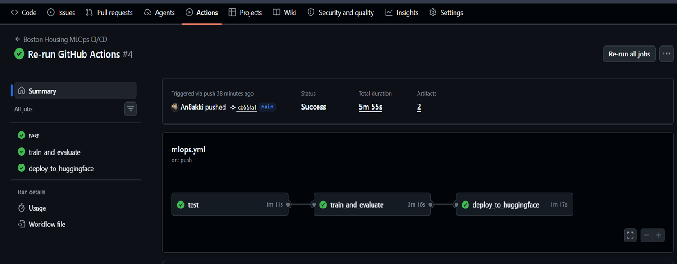
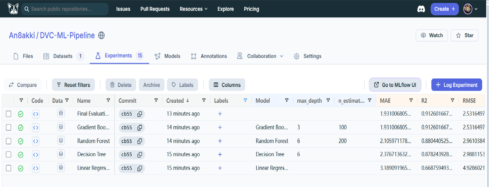
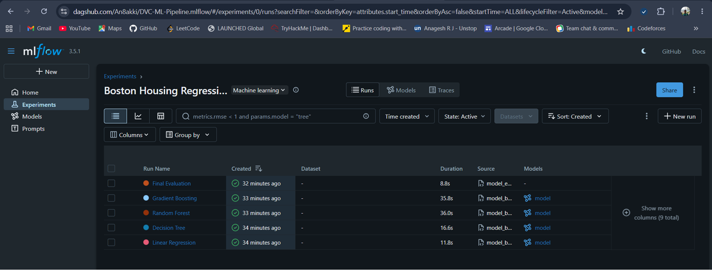
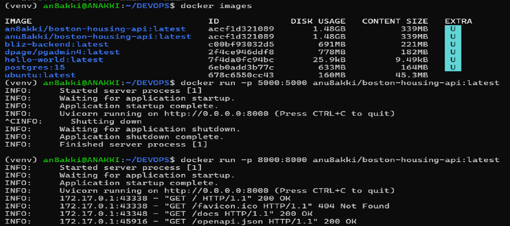

# Boston Housing MLOps Pipeline

An end-to-end Machine Learning Operations (MLOps) pipeline for the Boston Housing Regression dataset featuring automated data versioning, experiment tracking, CI/CD, Docker containerization and Hugging Face model deployment.

## Architecture


## Workflow

1. Data ingestion
2. Data preprocessing
3. Feature engineering
4. Train multiple regression models
5. Evaluate models
6. Automatically select the best model
7. Log experiments to MLflow & DagsHub
8. Save model using DVC
9. Build Docker image
10. CI/CD using GitHub Actions
11. Deploy model to Hugging Face Hub


## Tech Stack

- Python
- Scikit-Learn
- Pandas
- NumPy
- DVC
- MLflow
- DagsHub
- Docker
- FastAPI
- GitHub Actions
- Hugging Face Hub

## Model Performance

| Model | RMSE | R² |
|-------|------|------|
| Linear Regression | 4.93 | 0.67 |
| Decision Tree | 2.99 | 0.88 |
| Random Forest | 2.96 | 0.88 |
| Gradient Boosting | **2.53** | **0.91** |

## Continuous Integration

Every push to the main branch automatically:

- Runs syntax checks
- Executes the DVC pipeline
- Trains all models
- Evaluates performance
- Uploads artifacts
- Deploys the best model to Hugging Face

## Docker

Build

```bash
docker build -t boston-housing-api .

docker run -p 8000:8000 boston-housing-api

---

# API

```markdown
## API

Swagger

http://localhost:8000/docs

## GitHub Actions



---

## DagsHub



---

## MLflow



---

## Hugging Face


---

## Docker



---

## FastAPI


